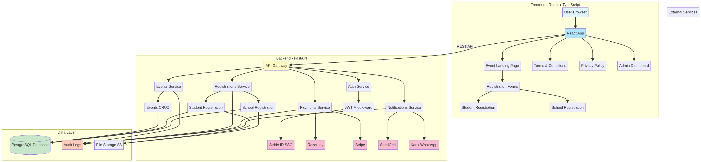
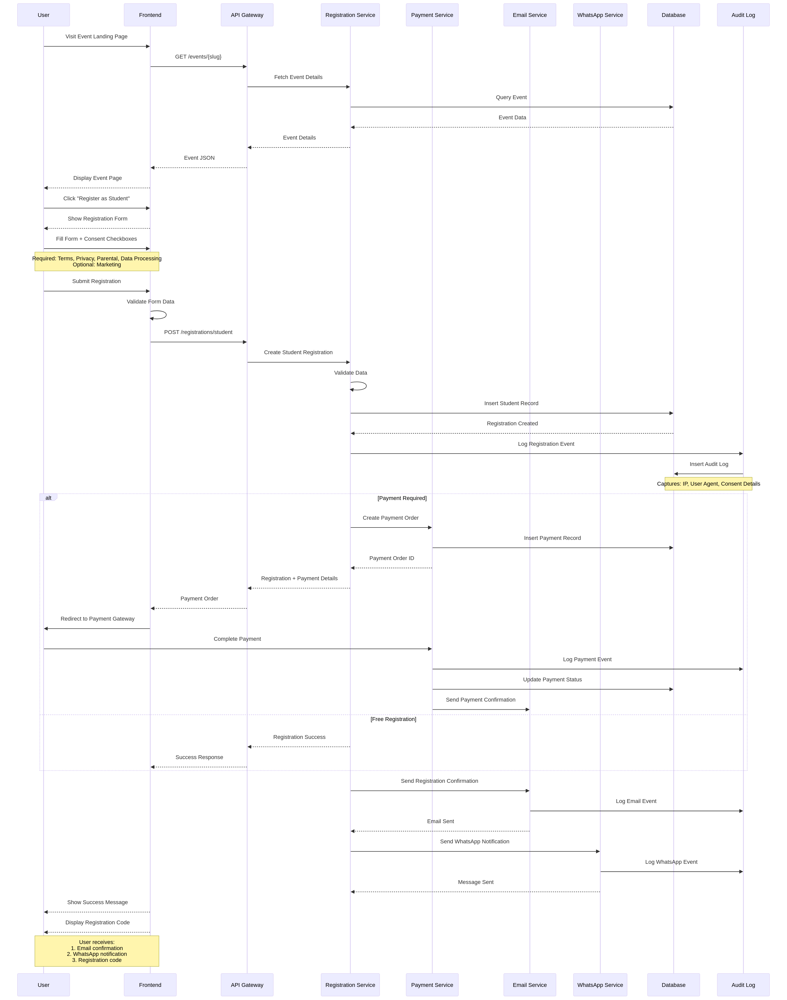
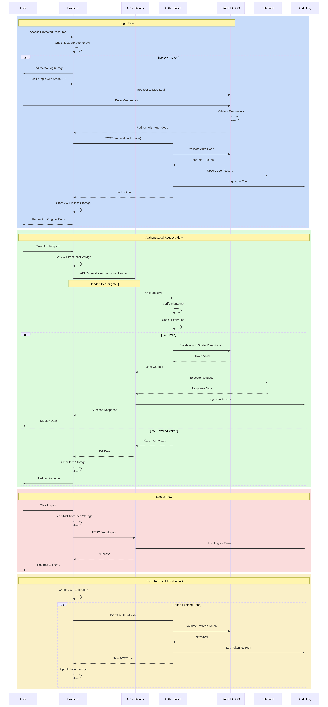
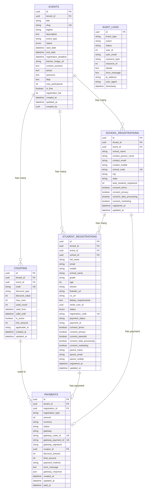
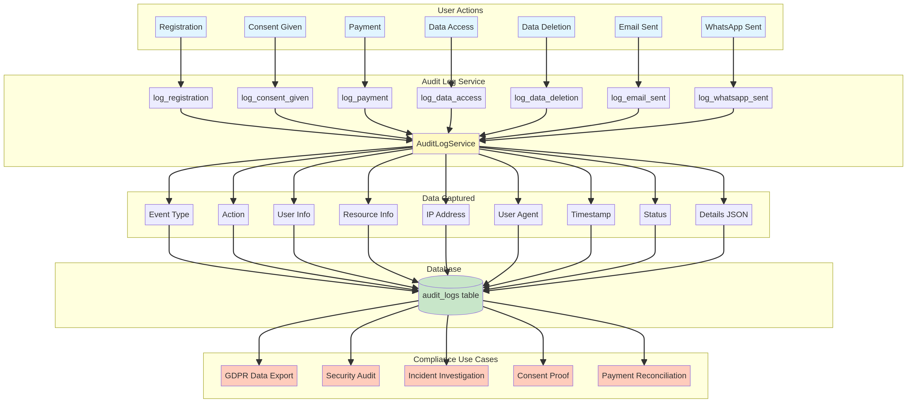
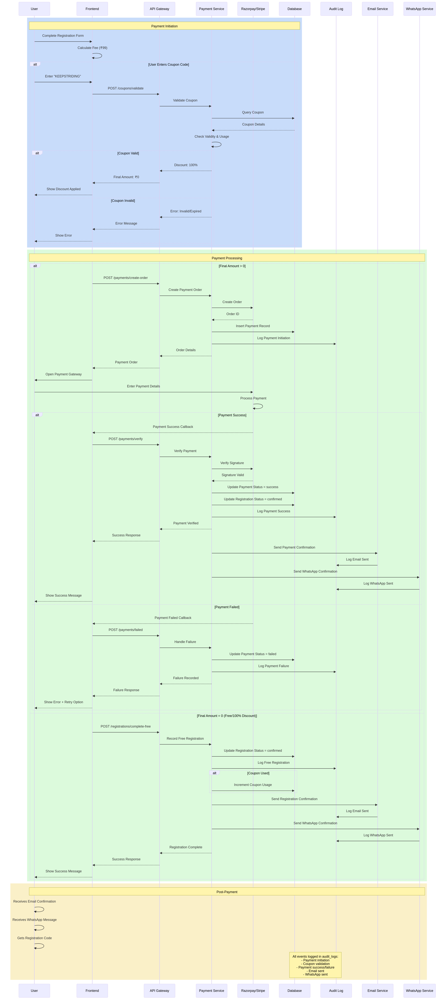

# Stride Events Platform - Architecture Documentation

This directory contains comprehensive flow diagrams and schema documentation for the Stride Events Platform.

---

## 📊 Available Diagrams

### 1. System Architecture (`architecture.mmd`)

**Overview:** High-level system architecture showing all components and their interactions.

**Includes:**
- Frontend components (React app, pages, forms)
- Backend services (Events, Registrations, Payments, Notifications, Auth)
- Data layer (PostgreSQL, Audit Logs, S3 Storage)
- External integrations (Stride ID, Razorpay, Stripe, SendGrid, Karix)

**View:** [architecture.mmd](./architecture.mmd)



---

### 2. Registration Flow (`registration-flow.mmd`)

**Overview:** Complete student/school registration process from landing page to confirmation.

**Includes:**
- Event page loading
- Form submission with consent checkboxes
- Payment processing (if required)
- Email and WhatsApp notifications
- Audit logging at each step

**View:** [registration-flow.mmd](./registration-flow.mmd)



---

### 3. Authentication Flow (`auth-flow.mmd`)

**Overview:** JWT authentication with Stride ID SSO integration.

**Includes:**
- Login flow with SSO redirect
- JWT token generation and storage
- Authenticated request handling
- Token validation and refresh
- Logout process

**View:** [auth-flow.mmd](./auth-flow.mmd)



---

### 4. Database Schema (`database-schema.mmd`)

**Overview:** Complete database schema with all tables and relationships.

**Tables:**
- `events` - Competition events
- `student_registrations` - Student participants
- `school_registrations` - School registrations
- `coupons` - Discount codes
- `payments` - Payment transactions
- `audit_logs` - Compliance and security tracking

**View:** [database-schema.mmd](./database-schema.mmd)



---

### 5. Audit Logging Flow (`audit-logging-flow.mmd`)

**Overview:** Comprehensive audit logging system for compliance.

**Tracks:**
- Registrations with consent details
- Payment transactions
- Data access events (GDPR)
- Email and WhatsApp notifications
- Data deletion requests

**View:** [audit-logging-flow.mmd](./audit-logging-flow.mmd)



---

### 6. Payment Flow (`payment-flow.mmd`)

**Overview:** Complete payment processing with Razorpay/Stripe integration.

**Includes:**
- Fee calculation
- Coupon validation (KEEPSTRIDING for 100% discount)
- Payment gateway integration
- Payment verification
- Success/failure handling
- Free registration flow (₹0 after discount)

**View:** [payment-flow.mmd](./payment-flow.mmd)



---

## 🎨 Viewing Diagrams

### Option 1: GitHub (Recommended)

GitHub automatically renders Mermaid diagrams. Just click on any `.mmd` file in the repository.

### Option 2: VS Code

Install the **Mermaid Preview** extension:
1. Open VS Code
2. Install extension: `bierner.markdown-mermaid`
3. Open any `.mmd` file
4. Click "Open Preview" button

### Option 3: Online Viewer

Copy diagram code and paste into:
- [Mermaid Live Editor](https://mermaid.live/)
- [Mermaid Chart](https://www.mermaidchart.com/)

### Option 4: Command Line

Use the `manus-render-diagram` utility:

```bash
# Render to PNG
manus-render-diagram docs/architecture.mmd docs/architecture.png

# Render all diagrams
for file in docs/*.mmd; do
    manus-render-diagram "$file" "${file%.mmd}.png"
done
```

---

## 📚 Documentation Structure

```
docs/
├── README.md                    # This file
├── architecture.mmd             # System architecture
├── registration-flow.mmd        # Registration process
├── auth-flow.mmd                # Authentication flow
├── database-schema.mmd          # Database schema
├── audit-logging-flow.mmd       # Audit logging
└── payment-flow.mmd             # Payment processing
```

---

## 🔄 Updating Diagrams

When making changes to the system:

1. **Update the relevant diagram** in this directory
2. **Commit with descriptive message**:
   ```bash
   git add docs/
   git commit -m "docs: Update registration flow to include new consent checkbox"
   ```
3. **Keep diagrams in sync** with code changes

---

## 📖 Related Documentation

- **[BACKEND_SETUP.md](../BACKEND_SETUP.md)** - Backend setup and API documentation
- **[COMPLIANCE_IMPLEMENTATION.md](../COMPLIANCE_IMPLEMENTATION.md)** - Legal compliance guide
- **[DEVELOPER_SETUP.md](../DEVELOPER_SETUP.md)** - Frontend setup guide
- **[KNOWN_ISSUES.md](../KNOWN_ISSUES.md)** - Known issues and fixes
- **[PROJECT_STATUS.md](../PROJECT_STATUS.md)** - Overall project status
- **[STRIDE_AHEAD_COMPLIANCE.md](../STRIDE_AHEAD_COMPLIANCE.md)** - Stride Ahead standards compliance

---

## 🎯 Quick Reference

### Key Flows

1. **User Registration:** `registration-flow.mmd`
2. **User Login:** `auth-flow.mmd`
3. **Payment Processing:** `payment-flow.mmd`
4. **Compliance Tracking:** `audit-logging-flow.mmd`

### Key Schemas

1. **Database Tables:** `database-schema.mmd`
2. **System Components:** `architecture.mmd`

---

## 💡 Tips for Developers

### Understanding the System

1. **Start with:** `architecture.mmd` - Get the big picture
2. **Then review:** `database-schema.mmd` - Understand data model
3. **Dive into:** Specific flow diagrams for features you're working on

### Making Changes

1. **Before coding:** Review relevant flow diagrams
2. **After coding:** Update diagrams if architecture changed
3. **During review:** Use diagrams to explain changes to team

### Debugging

1. **Follow the flow:** Use sequence diagrams to trace request path
2. **Check audit logs:** Use `audit-logging-flow.mmd` to understand what's logged
3. **Verify data:** Use `database-schema.mmd` to understand relationships

---

## 📞 Questions?

For questions about architecture or diagrams:
- **Technical:** dev@strideahead.in
- **Architecture:** architecture@strideahead.in

---

**Last Updated:** November 9, 2025  
**Version:** 1.0
